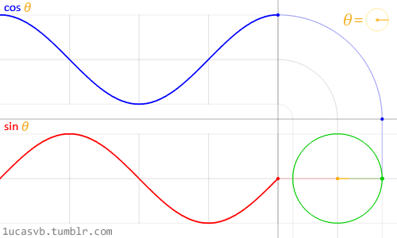
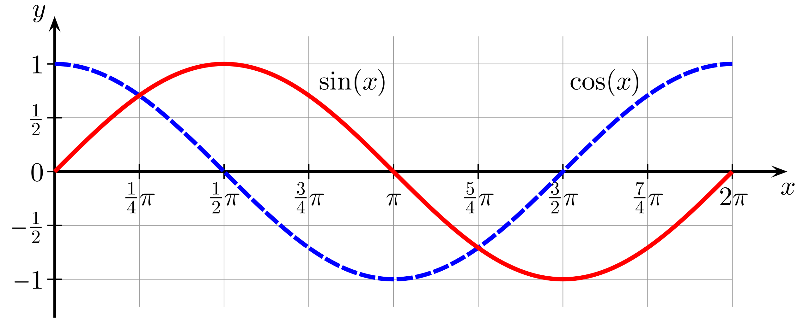

# CC/HLSL Intrinsic functions

**Links:**

- https://developer.download.nvidia.com/CgTutorial/cg_tutorial_appendix_e.html
- https://learn.microsoft.com/en-us/windows/win32/direct3dhlsl/dx-graphics-hlsl-intrinsic-functions

## Intrinsic functions

Intrinsic functions are CG/HLSL functions that does mathematical operations and help you to produce some effects. Like the word intrinsic suggest they are available without any include both in CG and HLSL.

<br>

### Abs

`abs()` return the input we provide as an absolute value, this means it return our input as a positive number.

```c#
abs(x) // return absolute value of x
```

> Examples:  
>`abs(-3) = 3`  
>`abs(7) = 7`  

`abs()` is useful to recreate many effects such as kaleidoscope or generating a triplanar projection:
- *Kaleidoscope*: Get the absolute value of the uv coordinates and offset the texture to place center the kaleidoscope effect.
- *Triplanar projection*: Determine absolute value of the mesh normal to generate projections on both and negative axis (https://catlikecoding.com/unity/tutorials/advanced-rendering/triplanar-mapping/)

> ▶️[*See example shader here (kaleidoscope effect)*](../../Assets/Shaders/CG_HLSL/Intrinsic%20functions/Abs.shader)

<br>

### Ceil

`ceil()` return the smallest integer that is not less than the input argument.

```c#
ceil(x) // smallest integer not less than x
```

> Examples:  
>`ceil(.2) = 1`  
>`ceil(1.7) = 2`

`ceil()` is useful to create effects like video game zoom or magnifying glass. For example to zoom in a texture we `ceil()` the value of UV coordinates, multiply them by 0.5 and lerp between default uv and modified uv.

> ▶️[*See example shader here (zoom in texture)*](../../Assets/Shaders/CG_HLSL/Intrinsic%20functions/Ceil.shader)

<br>

### Clamp

`clamp()` allows to limit a value to a minimum and maximum. We provide a value, a minimum and a maximum and `clamp()` return a value that is limited to be between the min and max.

```c#
clamp(x, min, max) 
```

> Examples:  
>`clamp(0.5, 0, 1) = 0.5`  
>`clamp(1.7, 0, 1) = 1`
>`clamp(-2, 0, 1) = 0`

`clamp()` is often used to limit color value between 0 and 1 to prevent color surexposition.

> ▶️[*See example shader here (limit texture gamma color with clamp)*](../../Assets/Shaders/CG_HLSL/Intrinsic%20functions/Clamp.shader)

<br>

### Sin and Cos

`sin()` and `cos()` are trigonometry functions that return the sine or the cosine of an angle.

- *sine*: ratio between opposite keg and hypotenuse
- *cosine*: ratio between adjacent keg and hypotenuse

```c#
sin(x) // sine of x
cos(x) // cosine of x
```




<!-- Backup link of the image: https://en.wikipedia.org/wiki/Sine_and_cosine#/media/File:Sine_cosine_one_period.svg -->

`sin()` and `cos()` are very useful functions in computer graphics, you can use them to generate geometric figures and matrix transformations.

For example, we can use `sin()` and `cos()` to rotate the vertices of an object. A vertex has 3d coordinates (X,Y,Z), we can transform them with a rotation matrix to simulate the illusion of a rotation. To rotate a vertex in 2D we calculate `sin(y axis value)` to have a wave motion from top to bottom and we calculate `cos(x axis value)` to have a wave motion from left to right. The combination of both reproduce a circular motion.

> ▶️[*See example shader here (vertex rotation)*](../../Assets/Shaders/CG_HLSL/Intrinsic%20functions/SinCos.shader)

<br>

### Tan

`tan()` is trigonometry functions that return the tangent of an angle.

- *tangent*: ratio of the opposite side to the adjacent side

```c#
tan(x) // tangent of x
```


<!-- Backup link of the image: https://fr.wikipedia.org/wiki/Tangente_(trigonom%C3%A9trie)#/media/Fichier:Tangent-plot.svg -->

`tan()` is a very useful function in computer graphics, you can use it to generate geometric figures and repeat pattern.

For example, we can use `tan()` to generate a procedural grid-like mask and use it to simulate an holographic projection effect. To do that we calculate the absolute value of the tangent at one of uv coordinates within the fragment shader.

> ▶️[*See example shader here (holographic effect)*](../../Assets/Shaders/CG_HLSL/Intrinsic%20functions/Tan.shader)

<br>

### Exp, Exp2 and Pow

`exp()`, `exp2()` and `pow()` are functions that use exponents to return new a value. More informations on exponential functions: https://en.wikipedia.org/wiki/Exponential_function.

```c#
exp(x) // e ^ x, e is euler number (=2.7182828182846f)
exp2(x) // 2 ^ x
pow(x, n) // x ^ n
```

`exp()`, `exp2()` and `pow()` are generally used to calculate noise, gamma increase in the output color and repetition patterns.

<br>

### Floor

`floor()` return the largest integer that is not greater than the input argument.

```c#
floor(x) // largest integer not greater than x 
```

> Examples:  
>`floor(1.2) = 1`  
>`floor(4,97) = 4`

`floor()` can be used to create effect with solid blocks of color like toon shader or to repeat pattern.

> ▶️[*See example shader here (base of toon shading effect)*](../../Assets/Shaders/CG_HLSL/Intrinsic%20functions/Floor.shader)

<br>

### Step and SmoothStep

`step()` and `smoothStep()` are similar functions that use an argument called edge to define the value that must be returned.

```c#
step(e, x) // return one when x is greater or equal to e. otherwise return 0.
smoothStep(min, max, x) // works like step() but the value returned is interpolated linearly
```

`step()` and `smoothstep()` are usually used to create mask.

> ▶️[*See example shader here (vertical mask)*](../../Assets/Shaders/CG_HLSL/Intrinsic%20functions/StepSmoothstep.shader)

<br>

### Length

`length()` return the euclidian length of a vector.

```c#
length(v) // return euclidian length of v vector) 
```

`length()` is useful to create geometric shapes like circle or polygonal shapes with rounded edges.

> ▶️[*See example shader here (circle shape)*](../../Assets/Shaders/CG_HLSL/Intrinsic%20functions/Length.shader)

<br>

### Frac

`frac()` return only the decimals of the input value.

```c#
frac(x) // return fractional part of x
```

> Examples:  
>`frac(3.27) = 0.27`  
>`frac(1.467) = 0.467`

`frac()` is used to create noise, random repeating patterns and much more.

> ▶️[*See example shader here (repetitive circle pattern)*](../../Assets/Shaders/CG_HLSL/Intrinsic%20functions/Frac.shader)

<br>

### Lerp

`lerp()` let you do a linear interpolation between two values.

```c#
lerp(a, b, t) // returned value is linearly interpolated between a and b based on t 
```
> Examples:  
>`lerp(0, 2, 0) = 0`  
>`lerp(0, 2, 0.5) = 1`  
>`lerp(0, 2, 1) = 2`  
>  
>`lerp(-1, 1, 0) = 0`  
>`lerp(-1, 1, 0.5) = -1`  
>`lerp(-1, 1, 1) = 1`  

`lerp()` can be used to make transitions between states like color transition.

> ▶️[*See example shader here (crossfade between textures)*](../../Assets/Shaders/CG_HLSL/Intrinsic%20functions/Lerp.shader)

<br>

### Min and Max

`min()` and `max()` simply compare 2 values to return the smallest or the biggest of the 2 values.

```c#
min(a, b) // minimum value betwwen a and b
max(a, b) // maximum value betwwen a and b  
```
> Examples:  
>`min(2, 6.1) = 2`  
>`max(3.1, 8.2) = 8.2`  

`min()` and `max()` can be used to calculate the diffusion of an object by returning the maximum between 0 and the dot product of the normal and the light direction.

<br>

### _Time, _SinTime, _CosTime

`_Time`, `_SinTime` and `_CosTime` are not intrinsic functions, they are built-in variables. Built-in variables are global variables included in Unity that you can use in your shader code. They give you access to things like the current object’s transformation matrices, the light parameters, the current time and so on.

More informations on built-in variables: https://docs.unity3d.com/540/Documentation/Manual/SL-UnityShaderVariables.html.

`_Time`, `_SinTime` and `_CosTime` give you access to your app time value. The time is measured in seconds and scaled by the *Time multiplier* parameter of the project *Time Settings*.

All the time built-in variables are four dimensions vector, each component of the vector returns a different time value:

**_Time**: Time since the level load (similar to Unity Time.timeSinceLevelLoad).

```c#
_Time.x = t/20
_Time.y = t // time since level load
_Time.z = t*2
_Time.w = t*3
```
**_SinTime**: Sine of the time.

```c#
_SinTime.x = t/8
_SinTime.y = t/4
_SinTime.z = t/2 
_SinTime.w = t // sin(_Time.y)
``` 

**_CosTime**: Cosine of the time.

```c#
_CosTime.x = t/8
_CosTime.y = t/4
_CosTime.z = t/2 
_CosTime.w = t // cos(_Time.y)
```
**_unity_DeltaTime**: Delta time (time of the frame).

```c#
_unity_DeltaTime.x = dt // deltaTime
_unity_DeltaTime.w = 1/smoothDt
_unity_DeltaTime.y = 1/dt
_unity_DeltaTime.z = smoothDt
```

The time built-in variable can be use to control the timing and animate our shader of the normal and the light direction.

> ▶️[*See example shader here (animate uv coordinate to make a scrolling texture)*](../../Assets/Shaders/CG_HLSL/Intrinsic%20functions/TimeSinTimeCosTime.shader)

<br>