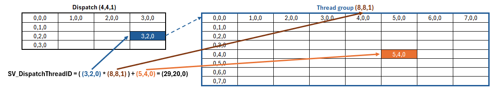

# Compute Shader

**Links:**

- https://docs.unity3d.com/6000.3/Documentation/Manual/class-ComputeShader.html
- https://learn.microsoft.com/en-us/windows/win32/direct3dhlsl/sm5-attributes-numthreads

## What is a Compute Shader ?

A compute shader is a program that can run data algorithms directly on the graphics card. Since GPU excels at doing lots of small calculation parallely we can use compute shader to generate high quality effects or to process operations that are not necessarily graphic but require calculations of millions of vertices or multiple instances of an object.

For example Ray-tracing and sphere tracing are both advanced techniques that rely on compute shader to process heavy operations on the GPU. However, the integration of this type of technique requires High-end GPU and are not compatible with low-end or mobile devices.

A compute shader file doesn't use the same extension as a standard shader, it use the *.compute* extension.

## Structure of a compute shader

Here is the structure of the default compute shader file:

```c#
#pragma kernel CSMain

RWTexture2D<float4> Result;

[numthreads(8,8,1)]
void CSMain (uint3 id : SV_DispatchThreadID)
{
    Result[id.xy] = float4(id.x & id.y, (id.x & 15)/15.0, (id.y & 15)/15.0, 0.0);
}
```

### #pragma kernel directive

```c#
#pragma kernel CSMain
```

Like `#pragma vertex vert` tells `vert()` is the vertex shader function, the `#pragma kernel` directive declare a function the compute shader must compile. You can declare as many functions as you need with `#pragma kernel` into a single compute shader file.

Every functions declared with `#pragma kernel` has an ID. The ID start at 0 and is incremented for each new function declared.

```c#
#pragma kernel CsMyFunction // ID is 0
#pragma kernel CsAnotherFunction // ID is 1

//... Next function will have the ID 2 and so on... 
```

### RWTexture2D and other variables

```c#
// Read/Write texture that store compute shader result
RWTexture2D<float4> Result; 
```

Like in any program we can declare global variables, `RWTexture2D<float4>` is a default global variable that is used to store the result of the operations done by the compute shader.

`RWTexture2D<float4>` is a 2D texture with RGBA value and which has Read/Write access. This allow its data to be sent from the CPU to the GPU, be processed in parallel and then returned inside the variable.

If we decompose the type, `RW` is a prefix that tell we want *Read/Write* access, `Texture2D` is the actual type of the variable and `<float4>` tells the value we want to store inside the texture, a 4 dimensional value means we want to have RGBA value.

We can declare more variables and if need a write-only access variable we can simply declare the variable without the `RW` prefix:

```c#
// Global variable with write access only
Texture2d<float4> WriteVariable;
```

### Numthreads

```c#
[numthreads(8,8,1)]
void CSMain(...) {...} // function affected by the numthreads attribute
```

`[numthreads()]` is an attribute we use to define the number of threads that must be used to process a function and calculate the texels of our `Result` texture.

```c#
// Arguments of the attribute
[numthreads(X, Y, Z)] // X is a number of columns, Y a number of rows and Z a depth.
```

When we declare the attributes it takes 3 input arguments which correspond to X, Y and Z value. These XYZ value are like the length of a 3D table, it has a number of columns (X), rows (Y) and a depth (Z) and we can think of it as a box of threads that will render a part of the texture: every entry in the table will be a thread and every thread will calculate one texel.

When we run the compute shader, multiple groups of threads are created and assigned to different computational unit to simultaneously process a part of the texture. Every groups have the same number of threads defined by `[numthreads(X, Y, Z)]`.

#### Calculate the number threads

Since XYZ value are the length of a 3D table of threads, if we want to calculate the total number of threads we will use we just have to multiply XYZ together: **number of threads = x * y * z**

> In this example, we defined `[numthreads(8,8,1)]` so we have 8 columns, 8 rows and 1 depth of threads. This give us a total of 64 threads (*8 * 8 * 1 = 64*).

#### Default number of threads

By default, the program use groups of 64 threads (`[numthreads(8,8,1)]` = *8 * 8 * 1 = 64*).

The reason Unity use this default value is to ensure compatibility with Nvidia and ATI GPU. To work with threads the hardware subdivide the groups into sub-block called **Warps** so the total number of threads per group must always be a multiple of the warp size:
- Nvidia use a multiple of the warp size (32 threads per group)
- ATI use a multiple of the wavefront size (64 threads per group)

### CSMain function

```c#
void CSMain (uint3 id : SV_DispatchThreadID)
{
    Result[id.xy] = float4(id.x & id.y, (id.x & 15)/15.0, (id.y & 15)/15.0, 0.0);
}
```

This function is the actual declaration and body of the function defined by the `#pragma kernel CSMain` directive. It contains all the operations we want to process on the GPU to calculate the value of a texel.
The function return the result of the operations by storing them into the `Result` read/write texture that was declared early.

### SV_DispatchThreadID semantic

The function use the semantic `SV_DispatchThreadID` as argument. This semantic is a `uint3` (3D vector of unsigned ints) which represent a unique identifier for a thread.

We can calculate this unique id by combining the coordinates of the thread group in the dispatch ([SV_GroupID](./3_ThreadGroups.md#sv_groupid)), the dimensions of numthreads and the coordinates of the thread in its thread group ([SV_GroupThreadID](./3_ThreadGroups.md#sv_groupthreadid))

```c#
SV_DispatchThreadID = ( SV_GroupID * numthreads ) + SV_GroupThreadID
```




