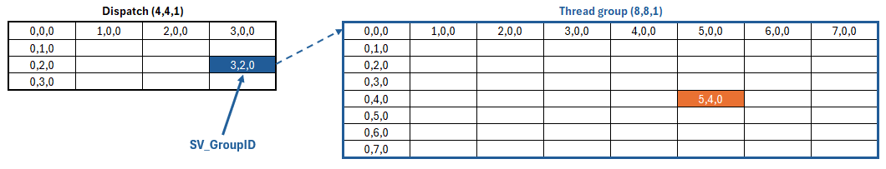
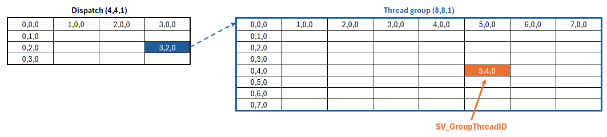
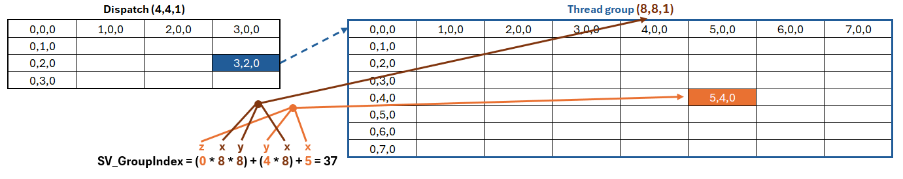

# Thread and Thread groups

**Links:**

- https://docs.unity3d.com/6000.3/Documentation/Manual/class-ComputeShader.html
- https://discussions.unity.com/t/compute-shader-sv_dispatchthreadid-to-texture-coord/889976
- https://learn.microsoft.com/en-us/windows/win32/direct3dhlsl/sv-dispatchthreadid
- https://learn.microsoft.com/en-us/windows/win32/direct3dhlsl/sm5-attributes-numthreads
- https://www.youtube.com/watch?v=XyUusirGAl4 

## Threads structure

A compute shader is a collection of GPU threads that does a specific operation. It could look like we just tell the GPU "render a texture of this size" and it handle the rest but what we actually do is that we organize and structure threads so they make enough work to calculate the texture. When we run a compute shader function, it is send to the threads we structured and every thread will run the function.

To structure our threads we have 3 levels:
- Thread (run compute shader function)
- Thread group (a collection of threads)
- Dispatch (a collection of thread group)


## What is a thread group ?

In the compute shader, when we define `[numthreads(X,Y,Z)]`, we tell the dimensions of an array of threads, this array is what we call a thread group or a work group.

When we call `Dispatch()`, we create a new array but this time it is composed of thread groups. `threadGroupX`, `threadGroupY`, and `threadGroupZ` arguments tells the XYZ dimensions of this array. Since threads groups are themself array of threads, ultimately the goal is that the thread group array generated by `Dispatch()` will give us enough threads to calculate our whole texture.

> So for example to calculate a **256*256** texture with thread groups of **8 * 8 * 1 threads** (`[numthreads(8,8,1)]`), if every thread calculate a texel of the texture, we will need **32 * 32 * 1 thread groups in our dispatch**.  
> To know that we simply divide the texture size in every dimension by the size of a thread group:  
> `threadGroupX` = 256 / 8 *(because 256 = `threadGroupX` * 8)*  
> `threadGroupY` = 256 / 8 *(because 256 = `threadGroupY` * 8)*  

### Why do we need thread groups ?

Why do we need to split our threads in thread groups instead of directly using a big array of thread ?

The purpose of a thread group is to organize threads to have an efficient data sharing and synchronization. The processors of a GPU are organized into sets called *warp* (Nvidia) or *wave* (Microsoft) that each have 32 processors (Nvidia) or 64 processors (ATI). When we call `Dispatch()` every thread group is sent to a warp and are executed on an independant compute unit. This means different thread groups cannot be synchronized, in fact we have no control on the order that will be used to process the thread groups. However, inside a thread group all the threads are on the same warp so they can be synchronized and they can even share memory.

> This also means that we want to send as much thread as we can into a single warp to optimize our compute shader. We can progressively increase `numthreads` and profile the performance to find that.

### Debugging a thread group

> Using a `numthread` of **1 * 1 * 1** can be very useful to debug a compute shader.

## Thread semantics

### SV_GroupID

`uint3` *(vector3 of unsigned integer)*

**SV_GroupID** store the coordinates of a thread group inside the dispatch array. The coordinates are for the whole thread group and not an individual thread in the group.



### SV_GroupThreadID

`uint3` *(vector3 of unsigned integer)*

**SV_GroupThreadID** store the coordinates of the thread inside its thread group array.



### SV_DispatchThreadID

`uint3` *(vector3 of unsigned integer)*

**SV_DispatchThreadID** is a unique identifier for a thread. It is calculated by combining the values of **SV_GroupID**, **numthreads** and **SV_GroupThreadID**.

```c#
SV_DispatchThreadID = ( SV_GroupID * numthreads ) + SV_GroupThreadID
```


### SV_GroupIndex

`uint` *(unsigned integer)*

**SV_GroupIndex** is a conversion of the xyz value of **SV_GroupThreadID** to a one dimensional value.

```c#
SV_GroupIndex = (SV_GroupThreadID.z * numthreads.x * numthreads.y) + (SV_GroupThreadID.y * numthreads.x) + SV_GroupThreadID.x
```



